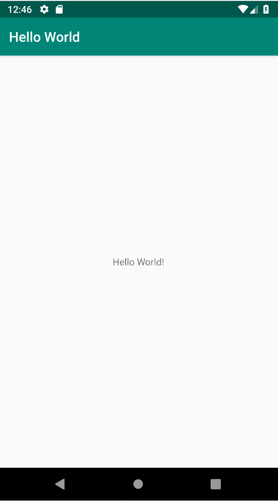

# Android Kotlin 基础：开始

## 1.欢迎

这个 codelab 是安卓基础课程的一部分。如果按顺序完成这些codelab，你将从本课程中获得最大收货。所有课程对应的 codelab 都罗列在 [Android Kotlin 基础 codelab 专题页面](https://developer.android.com/courses/kotlin-android-fundamentals/overview)。

### 介绍

在此 Codelab 中，您将在模拟器和物理设备上创建并运行您的第一个 Android 应用程序 HelloWorld。您还将探索 Android 项目的外观。

### 你需要已经了解

* 您应该了解使用 IDE（集成开发环境）（例如 Android Studio）的面向对象应用程序的一般软件开发过程。
* 您应该具有至少一年的面向对象编程经验，至少了解 Java 和 Kotlin。

### 你将学到

如何在 Android Studio 中构建一个基础 Android 应用。  
如何从模板创建 Android 项目。  
如何查找 Android 项目的主要组件。  
如何在模拟器或物理设备上运行 Android 应用程序。

### 你将要做

* 创建一个新的 Android 项目和一个名为 HelloWorld 的默认应用程序。
* 创建一个模拟器（一个虚拟设备），这样你就可以在你的计算机上运行你的应用程序。
* 在虚拟和物理设备上运行 HelloWorld 应用程序。
* 探索项目布局。
* 探索 `AndroidManifest.xml` 文件。

### 2.App 概述

HelloWorld 应用程序在 Android 虚拟设备或物理设备的屏幕上显示字符串“Hello World”。该应用程序如下所示：

### 3.任务：创建 HelloWorld 项目

在此任务中，您将创建一个新的应用项目以验证 Android Studio 是否已正确安装。

1. 如果 Android Studio 尚未打开，请打开它。
2. 在 **Welcome to Android Studio** 主对话框中，单击 **Start a new Android Studio project**。   
3. 出现 **Choose your project** 对话框。选择如下所示的 **Empty Activity**，然后单击 **Next**。   
4. [`Activity`](https://developer.android.com/reference/android/app/Activity.html)是用户可以做的单一、专注的事情。每个应用程序必须至少有一个活动作为其入口点。   
5. 接受公司域（**Company domain**）的默认 **android.example.com** ，或创建唯一的公司域。此值加上应用程序的名称就是你的应用程序的包名称。如果您不打算发布你的应用程序，请接受默认设置。您可以稍后更改应用程序的包名称，但这是额外的工作。
6. 验证默认保存位置（**Save location**）是您要存储应用程序的位置。如果没有，请将位置更改为您的首选目录。
7. 确保语言（**Language**）是 Kotlin。
8. 确保最低 API （**Minimum API level**）级别为 **API 19：Android 4.4 \(KitKat\)**。在编写此代码实验室时，Android Studio 表示使用此 API 级别，该应用程序将在大约 95.3% 的设备上运行。（您可以在稍后的代码实验室中了解有关最低 API 级别的更多信息。要立即了解更多信息，请单击“帮助我选择”，这会打开一个包含 API 级别信息的窗口。）
9. 选中使用 AndroidX （**Use AndroidX artifacts**）工件复选框。
10. 清除所有其他复选框，然后单击**Finish**。如果您的项目需要为您选择的目标 SDK 提供更多组件，Android Studio 会自动安装它们，这可能需要一段时间。按照提示操作并接受默认选项。

Android Studio 现在会创建您的项目，这可能需要一些时间。你不应该得到任何错误。如果您收到任何警告，请忽略它们。

### 4.任务：探索 Android Studio

在本任务中，您将探索 Android Studio 中的 HelloWorld 项目并学习使用 Android Studio 进行开发的基础知识。

